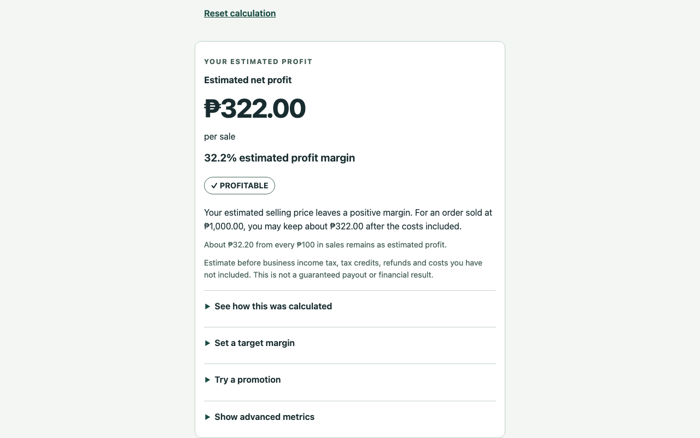

# Marketplace Profit Intelligence

[GitHub repository](https://github.com/paulcastor30/marketplace-profit-intelligence) · [Report an issue](https://github.com/paulcastor30/marketplace-profit-intelligence/issues) · [Privacy policy](https://github.com/paulcastor30/marketplace-profit-intelligence/blob/main/docs/privacy-model.md)

[](https://github.com/paulcastor30/marketplace-profit-intelligence/actions/workflows/ci.yml)

**Know your estimated profit before you price, promote, or source a product.**

A GPL-3.0 Chrome Manifest V3 side-panel extension for **Shopee Philippines only**. Calculations run on your device. No signup, AI, database, cloud sync or analytics. Independent of Shopee.

**Status: 0.1.0 pre-release. Not yet available in the Chrome Web Store. Do not describe this build as production-ready.**



## What it does

Enter a selling price and product cost. Review your seller's fee assumptions, then calculate estimated profit and margin. Optional costs, an auditable breakdown, promotion comparisons, target prices, ROI, maximum ad budget and break-even ROAS are available behind expandable sections. Data export/delete and larger text are built in.

Standard Marketplace category references, shipping caps, transaction/processing rules and MDV/Live rates were checked against Shopee's official seller page and its linked commission document on 7 October 2026. **There is no universal commission rate.** Select a reference category and confirm seller eligibility/program enrollment, or enter overrides. Mall commission, detailed settlement rounding, spike-day cap and pre-order basis remain reviewed assumptions. Verification is partial. [Methodology](docs/fee-methodology.md).

## Install (public users)

The Chrome Web Store installation link will be added after review and publication. Normal users will choose **Add to Chrome**, open a Shopee PH product and click the extension icon. No developer tools or account will be required. Public installation is not available yet.

## Develop and evaluate (contributors)

### Download an automatically built testing package

Every successful push or pull request saves an extension ZIP, matching GPL source ZIP and SHA-256 checksums for 30 days. Open [Actions → Checks](https://github.com/paulcastor30/marketplace-profit-intelligence/actions/workflows/ci.yml), select a successful run, and download its `extension-testing-...` artifact. Sign in to GitHub to download artifacts. You can also choose **Run workflow** on that page to build a selected branch manually.

Extract the downloaded artifact, then extract `ecommerce-profit-intelligence-VERSION.zip` (not the source ZIP). In `chrome://extensions`, enable **Developer mode**, choose **Load unpacked**, and select the extracted folder containing `manifest.json`. GitHub's **Download ZIP** button downloads source code and cannot be loaded directly into Chrome.

Successful builds of `main` also appear under [Releases](https://github.com/paulcastor30/marketplace-profit-intelligence/releases) as **testing prereleases**, with the extension ZIP, matching source and checksums attached. Download the extension ZIP directly and extract it to load in Chrome. These downloads remain available beyond the Actions artifact retention period.

For full releases, see the [release procedure](docs/release-process.md). Version tags create full GitHub releases only after all readiness gates pass. Chrome Web Store submission remains manual.

### Build locally

Use Node 24+ and pnpm 11.25.0:

```sh
pnpm install --frozen-lockfile
pnpm exec playwright install chromium
pnpm check
pnpm test:coverage
pnpm package
```

Load `dist/` as an unpacked extension at `chrome://extensions` for developer evaluation only. Click its toolbar icon to open the side panel. Chrome 116+ is required. Automatic extraction is conservative; unsupported DOMs, ranges, hidden values and conflicting prices request manual entry. No private Shopee APIs are used.

The extension ZIP is `artifacts/ecommerce-profit-intelligence-0.1.0.zip`; matching GPL source is `artifacts/ecommerce-profit-intelligence-source-0.1.0.zip`. **A ZIP is a review artifact, not proof of release readiness.** [Release blockers and scores](docs/qa-report.md).

## Trust and accessibility

- Local integer-centavo calculations with explicit peso/centavo rounding.
- No telemetry, network requests, remote executable code, secrets or automatic purchases/pricing.
- Exact Shopee PH content-script match; only `storage` and `sidePanel` API permissions.
- Semantic labels, text profit states, visible keyboard focus, live result announcements, 44px controls, narrow reflow, reduced motion and forced-color support.
- Automated accessibility tests do not prove WCAG conformance. VoiceOver and representative-user tests are pending.

[Privacy](docs/privacy-model.md) · [Permissions](docs/permissions.md) · [Accessibility](docs/accessibility.md) · [Testing](docs/testing.md) · [Architecture](docs/architecture.md)

## Contribute and support

See [CONTRIBUTING.md](CONTRIBUTING.md), [SECURITY.md](SECURITY.md), and [CODE_OF_CONDUCT.md](CODE_OF_CONDUCT.md). This project is free and open source. If it saves you time or money, you can support continued development and marketplace fee maintenance.

Ko-fi and GitHub Sponsors handles are not configured. `.github/FUNDING.yml` deliberately contains no active links. Add only the maintainer's confirmed accounts; see [support setup](docs/support-setup.md).

## Roadmap

V1 remains Shopee PH only. First priorities are settlement reconciliation and remaining fee exceptions, real product compatibility evidence, screen-reader validation and usability trials. A later paid fee-maintenance service can implement the existing adapter/config interface; it is not included now. [Roadmap](docs/roadmap.md).

No hosted website or recurring infrastructure is required by this build. The canonical GitHub repository is configured. Store distribution and optional support services still need maintainer setup. Store registration may have a one-time fee; verify it before signing up. No claim is made about external free-tier commercial hosting.
